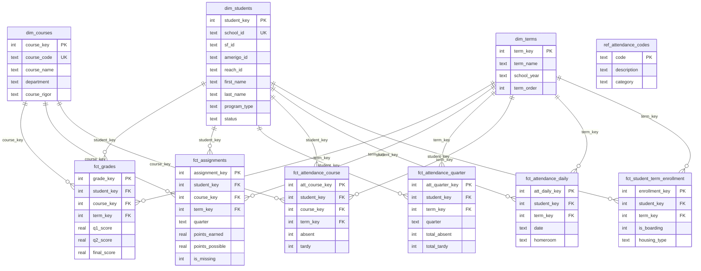

# Education Data Warehouse

School data warehouse tracking 636 Foreign Exchange students across 4 school years. Star schema design with 312K+ records integrating data from 3 source systems (SIS, CRM, boarding). Built for accountability analytics and at-risk identification.
## Database Schema

*Star schema design: 3 dimension tables, 6 fact tables, 1 reference table. 312,439 total records across 4 school years (2022-2026).*

## Database Tables

| Table | Rows |
|-------|------|
| dim_students | 636 |
| dim_terms | 8 |
| dim_courses | 1,058 |
| fct_grades | 8,623 |
| fct_assignments | 265,571 |
| fct_attendance_quarter | 3,884 |
| fct_attendance_course | 7,792 |
| fct_attendance_daily | 22,884 |
| fct_student_term_enrollment | 1,942 |
| ref_attendance_codes | 41 |
| **Total** | **312,439** |

