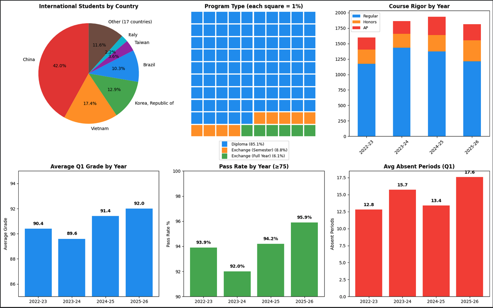
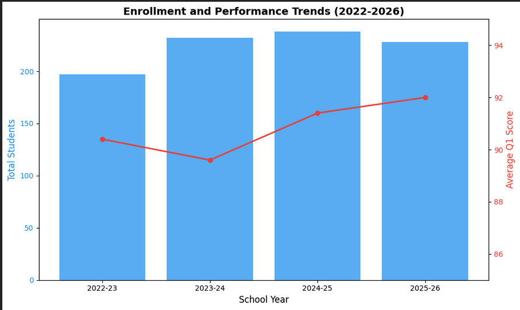

# Education Data Warehouse

School data warehouse tracking 636 Foreign Exchange students across 4 school years. Star schema design with 312K+ records integrating data from 3 source systems (SIS, CRM, boarding). Built for accountability analytics and at-risk identification.

## Key Metrics

| Metric | Value |
|--------|-------|
| Total Records | 312,439 |
| Unique Students | 636 |
| School Years | 4 (2022-2026) |
| Source Systems | 3 (Infinite Campus, Salesforce, Reach) |
| Countries Represented | 23 |
| Average Pass Rate | 94.0% |

## Database Schema


*Star schema design: 3 dimension tables, 6 fact tables, 1 reference table.*

## Database Tables

| Table | Rows | Description |
|-------|------|-------------|
| dim_students | 636 | Student dimension with demographics |
| dim_terms | 8 | Academic terms (Fall/Spring × 4 years) |
| dim_courses | 1,058 | Course catalog with rigor levels |
| fct_grades | 8,623 | Quarterly grades by student/course |
| fct_assignments | 265,571 | Individual assignment scores |
| fct_attendance_quarter | 3,884 | Quarter-level attendance summary |
| fct_attendance_course | 7,792 | Course-level attendance |
| fct_attendance_daily | 22,884 | Daily attendance by period |
| fct_student_term_enrollment | 1,942 | Term enrollment with boarding status |
| ref_attendance_codes | 41 | Attendance code definitions |
| **Total** | **312,439** | |

---

## Analytics Dashboard



**Top Row:** Population demographics (Countries, Program Types, Course Rigor)
**Bottom Row:** Year-over-year accountability metrics (Average Grade, Pass Rate, Attendance)  

---

## Sample Analysis

### 1. Enrollment and Performance Trends



Dual-axis visualization showing enrollment growth alongside academic performance over 4 years.
```sql
SELECT 
    t.school_year,
    COUNT(DISTINCT g.student_key) as total_students,
    ROUND(AVG(g.q1_score), 1) as avg_q1,
    ROUND(AVG(g.q2_score), 1) as avg_q2,
    SUM(CASE WHEN g.q1_score < 75 THEN 1 ELSE 0 END) as failing_grades,
    ROUND(100.0 * SUM(CASE WHEN g.q1_score >= 75 THEN 1 ELSE 0 END) / COUNT(*), 1) as pass_rate
FROM fct_grades g
JOIN dim_terms t ON g.term_key = t.term_key
WHERE g.q1_score IS NOT NULL
GROUP BY t.school_year
ORDER BY t.school_year;
```

---

### 2. Retention Risk Analysis


**Finding:** Students who stay longer miss less homework — 3x difference between short-term (1.8%) and long-term (0.6%) students. This pattern suggests missing homework rate could serve as an early warning indicator for retention risk.
```sql
SELECT 
    terms_enrolled,
    ROUND(AVG(missing_pct), 1) as avg_missing_pct,
    COUNT(*) as num_students
FROM (
    SELECT 
        s.student_key,
        COUNT(DISTINCT e.term_key) as terms_enrolled,
        COUNT(a.assignment_key) as total_assignments,
        SUM(a.is_missing) as missing_assignments,
        ROUND(100.0 * SUM(a.is_missing) / COUNT(a.assignment_key), 1) as missing_pct
    FROM dim_students s
    JOIN fct_student_term_enrollment e ON s.student_key = e.student_key
    JOIN fct_assignments a ON s.student_key = a.student_key
    GROUP BY s.student_key
    HAVING total_assignments >= 20
) student_metrics
GROUP BY terms_enrolled
ORDER BY terms_enrolled;
```

---

## Technical Details

| Component | Technology |
|-----------|------------|
| Database | SQLite |
| Schema Design | Star schema (Kimball methodology) |
| Data Sources | Infinite Campus (SIS), Salesforce (CRM), Reach (Boarding) |
| Visualization | Python (matplotlib, pandas) |
| Identity Resolution | Cross-platform ID matching across 3 systems |

### Data Pipeline
```
Infinite Campus ─┐
                 │
Salesforce ──────┼──► Identity Resolution ──► Star Schema ──► Analytics
                 │
Reach ───────────┘
```

---

## Additional Queries

See [`queries/Queries.sql`](queries/Queries.sql) for additional SQL examples including:
- At-risk student identification
- Course performance analysis
- Boarding vs. day student comparisons
- Attendance pattern analysis

---

## Skills Demonstrated

- **Data Modeling:** Star schema design with proper dimension/fact separation
- **SQL:** Complex joins, window functions, aggregations, subqueries
- **Data Integration:** Identity resolution across 3 disparate systems
- **Analytics:** Year-over-year trending, cohort analysis, at-risk identification
- **Visualization:** Multi-chart dashboards, dual-axis charts, waffle charts
