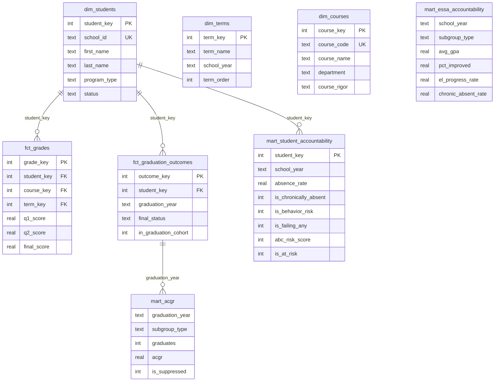
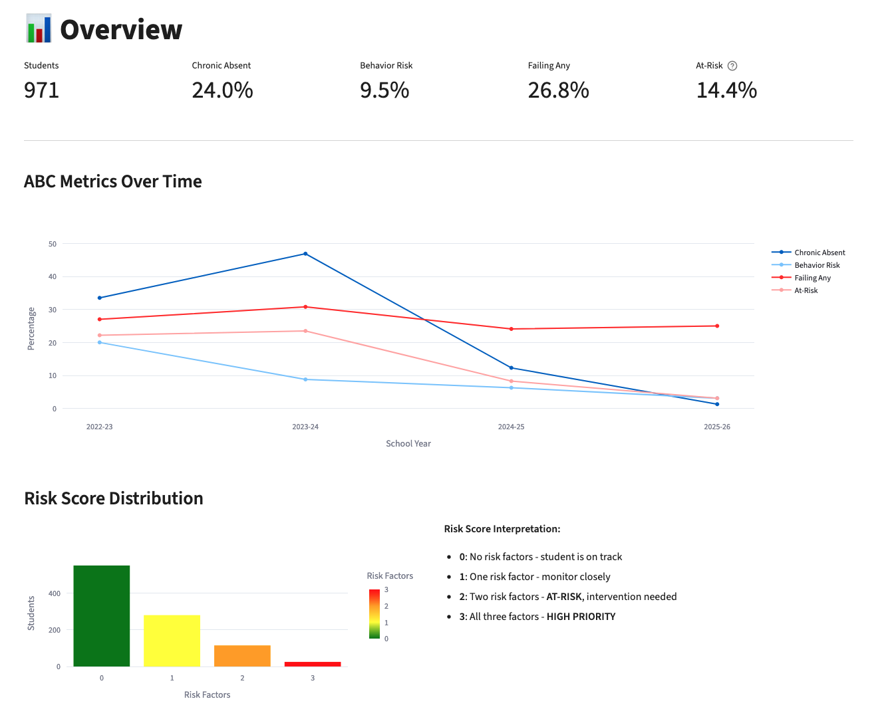
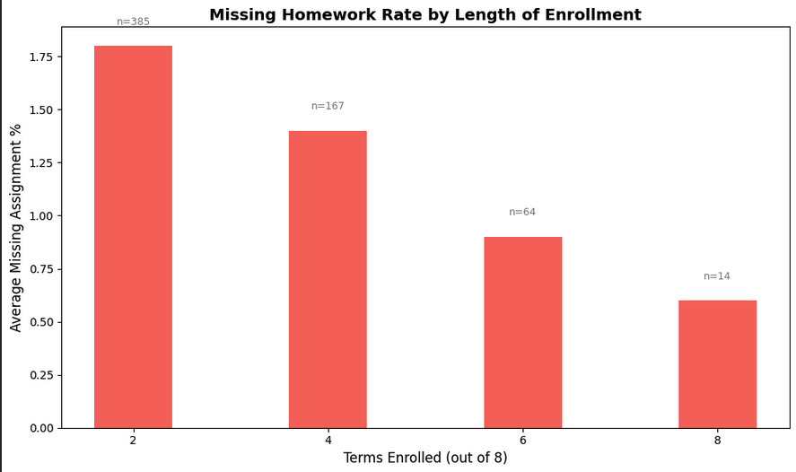

# Education Data Warehouse

Student data warehouse tracking **636 international SUPERHERO students** across 4 school years. Star schema design with **329K+ records** integrating data from 3 source systems. Built to demonstrate K-12 accountability analytics using the **ABC Early Warning Framework** and **ESSA Accountability Indicators**.

## Live Dashboard

**[View Interactive Dashboard](https://education-data-bvqfw2xtdke5dfugzzh3x3.streamlit.app/)** *(Streamlit Cloud)*

---

## Key Metrics

| Metric | Value |
|--------|-------|
| Total Records | 329,574 |
| Unique Students | 636 |
| School Years | 4 (2022-2026) |
| Source Systems | 3 (Infinite Campus, Salesforce, Reach) |
| Countries Represented | 23 |
| Graduation Years | 4 (2022-2026) |
| ESSA Indicators | 5 |
| Average Pass Rate | 94.0% |

---

## Tech Stack

| Layer | Technology | Purpose |
|-------|------------|---------|
| Database | **DuckDB** | Analytical database (columnar, fast) |
| Transformation | **dbt-core** | SQL modeling with tests & docs |
| Dashboard | **Streamlit** | Interactive web application |
| Visualization | **Plotly** | Charts and graphs |
| Cloud | **Streamlit Cloud** | Free hosting |

---

## Project Structure

```
Education-Data/
├── README.md
├── requirements.txt
├── .gitignore
│
├── data/
│   ├── school_analytics.duckdb       # Original database (5.3 MB)
│   └── school_analytics_v3.duckdb    # V3 database with ESSA tables (9 MB)
│
├── dbt_project/                       # dbt transformation layer
│   ├── dbt_project.yml
│   ├── profiles.yml
│   └── models/
│       ├── sources.yml               # 16 source tables
│       ├── staging/                  # 5 staging models
│       ├── intermediate/             # 4 intermediate models
│       └── marts/                    # 4 mart models
│           ├── mart_student_accountability.sql
│           ├── mart_school_year_summary.sql
│           ├── mart_acgr.sql         # V3: Graduation rates
│           └── mart_essa_accountability.sql  # V3: ESSA indicators
│
├── streamlit_app/                     # Interactive dashboard
│   ├── app.py
│   └── pages/
│       ├── 1_📊_Overview.py
│       ├── 2_👤_Student_Detail.py
│       ├── 3_📈_Subgroup_Analysis.py
│       ├── 4_🎓_ACGR_Tracker.py       # V3: Graduation tracking
│       └── 5_📋_ESSA_Scorecard.py     # V3: ESSA indicators
│
├── images/                            # Visualization assets
│
├── queries/                           # Sample SQL queries
│
└── docs/                              # Documentation
    ├── CURRENT_STATE.md
    ├── TARGET_STATE.md
    ├── MIGRATION_PLAN.md
    └── V3_TABLES_DOCUMENTATION.md     # V3: Complete table docs
```

---

## ABC Early Warning Framework

Students are identified as **at-risk** using three indicators aligned with ESSA accountability requirements:

| Factor | Metric | Threshold | Column |
|--------|--------|-----------|--------|
| **A**ttendance | Chronic Absence | ≥10% days missed | `is_chronically_absent` |
| **B**ehavior | Discipline | ISS≥1, OSS≥1, Cuts≥2, or Truancy≥1 | `is_behavior_risk` |
| **C**ourse | Failing Grades | Any final grade <75 | `is_failing_any` |

**At-Risk Definition**: Students with **2+ risk factors** (abc_risk_score ≥ 2)

### Results by Year

| Year | Students | Chronic Absent | Behavior Risk | Failing Any | At-Risk |
|------|----------|----------------|---------------|-------------|---------|
| 2022-23 | 230 | 33.5% | 20.0% | 27.0% | 22.2% |
| 2023-24 | 260 | 46.9% | 8.8% | 30.8% | 23.5% |
| 2024-25 | 253 | 12.3% | 6.3% | 24.1% | 8.3% |
| 2025-26 | 228 | 1.3% | 3.1% | 25.0% | 3.1% |

*Note: 2025-26 is partial year (Fall semester only)*

---

## ESSA Accountability Framework (V3)

The V3 release adds comprehensive ESSA (Every Student Succeeds Act) alignment with all 5 federal accountability indicators:

### ESSA Scorecard (2025-26)

| Indicator | Metric | Value | Target |
|-----------|--------|-------|--------|
| 1. Academic Achievement | GPA / Pass Rate | 91.7 / 93.1% | Higher is better |
| 2. Academic Growth | % Improved YoY | 54.3% | Higher is better |
| 3. Graduation Rate | ACGR | 100.0% | ≥90% |
| 4. EL Proficiency | % Progressed | 56.8% | Higher is better |
| 5. School Quality | Chronic Absent | 1.3% | Lower is better |

### Graduates by Year

| Graduation Year | Graduates | ACGR |
|-----------------|-----------|------|
| 2022-23 | 87 | 100% |
| 2023-24 | 58 | 100% |
| 2024-25 | 65 | 100% |
| 2025-26 | 33 | 100% |

**Total: 243 graduates** - All diploma-seeking seniors who completed Q4 grades graduated

### FERPA Compliance

All subgroup reporting includes **N-size suppression** (N<10) to protect student privacy:
- Suppressed values shown as "--" in dashboard

---

## Database Schema



---

## Database Tables

### Core Tables (Original)

| Table | Rows | Description |
|-------|------|-------------|
| dim_students | 636 | Student dimension (anonymized) |
| dim_terms | 8 | Academic terms |
| dim_courses | 1,058 | Course catalog |
| fct_grades | 8,623 | Quarterly grades |
| fct_assignments | 265,571 | Assignment scores |
| fct_attendance_quarter | 3,884 | Quarter attendance |
| fct_attendance_course | 7,792 | Course attendance |
| fct_attendance_daily | 22,884 | Daily attendance |
| fct_student_term_enrollment | 1,942 | Enrollment by term |
| ref_attendance_codes | 42 | Code definitions |

### V3 Tables (New)

| Table | Rows | Type | Purpose |
|-------|------|------|---------|
| fct_graduation_outcomes | 627 | Derived | Graduation tracking, final status |
| fct_esl_progression | 971 | Derived | EL proficiency tracking |
| fct_course_credits | 8,623 | Derived | Credits attempted/earned |
| fct_standardized_tests | 332 | Synthetic | PSAT/SAT scores |
| fct_ap_exam_scores | 976 | Derived | AP exam results |
| fct_interventions | 502 | Fabricated | Intervention records |
| **mart_acgr** | **69** | **Aggregated** | **Graduation rates by subgroup** |
| **mart_essa_accountability** | **132** | **Aggregated** | **5 ESSA indicators** |

### Marts Summary

| Table | Rows | Description |
|-------|------|-------------|
| mart_student_accountability | 971 | ABC risk profiles |
| mart_school_year_summary | 32 | Aggregated metrics |
| mart_acgr | 69 | Graduation rates by subgroup |
| mart_essa_accountability | 132 | ESSA indicators |
| **Total** | **~329K** | |

---

## 📈 Analytics Dashboard

### Dashboard Pages

| Page | Description |
|------|-------------|
| 🏠 Home | ABC framework intro, quick stats |
| 📊 Overview | KPIs, trend charts, risk distribution |
| 👤 Student Detail | Individual student profiles |
| 📈 Subgroup Analysis | Compare by gender/program/boarding |
| 🎓 ACGR Tracker | **V3:** Graduation rates by year |
| 📋 ESSA Scorecard | **V3:** 5 ESSA indicators dashboard |

### Overview


### ACGR Tracker


### ESSA Scorecard


---

## 🔍 Sample Analysis

### 1. Graduates by Subgroup

```sql
SELECT 
    graduation_year,
    subgroup_type,
    subgroup_value,
    graduates as n,
    acgr,
    CASE WHEN is_suppressed = 1 THEN 'Suppressed' ELSE 'Reported' END as status
FROM mart_acgr
WHERE subgroup_type = 'Gender'
ORDER BY graduation_year, subgroup_value;
```

### 2. ESSA Indicator Trends

```sql
SELECT 
    school_year,
    avg_gpa as "Indicator 1: Achievement",
    pct_improved as "Indicator 2: Growth",
    el_progress_rate as "Indicator 4: EL Progress",
    chronic_absent_rate as "Indicator 5: Chronic Absent"
FROM mart_essa_accountability
WHERE subgroup_type = 'Overall'
ORDER BY school_year;
```

### 3. Retention Risk Analysis



**Finding:** Students who stay longer miss less homework — 3x difference between short-term (1.8%) and long-term (0.6%) students.

---

## Quick Start

### Prerequisites
- Python 3.9+
- pip

### Installation

```bash
# Clone repository
git clone https://github.com/SamOryeJack/Education-Data.git
cd Education-Data

# Install dependencies
pip install -r requirements.txt

# Run dbt models (optional - already materialized)
cd dbt_project
dbt run --profiles-dir .
dbt test --profiles-dir .

# Launch dashboard locally
cd ../streamlit_app
streamlit run app.py
```

---

## dbt Models

### Model Lineage

```
Source Tables (16)
    │
    ▼
Staging Layer (5 views)
    ├── stg_students
    ├── stg_grades
    ├── stg_attendance_quarter
    ├── stg_attendance_daily
    └── stg_assignments
    │
    ▼
Intermediate Layer (4 tables)
    ├── int_student_attendance      → is_chronically_absent
    ├── int_student_behavior        → is_behavior_risk
    ├── int_student_course_performance → is_failing_any
    └── int_student_assignments     → is_high_missing
    │
    ▼
Marts Layer (4 tables)
    ├── mart_student_accountability → Complete ABC profile
    ├── mart_school_year_summary    → Aggregated metrics
    ├── mart_acgr                   → V3: Graduation rates
    └── mart_essa_accountability    → V3: ESSA indicators
```

### Running dbt

```bash
cd dbt_project
dbt debug --profiles-dir .   # Verify connection
dbt run --profiles-dir .     # Build all models
dbt test --profiles-dir .    # Run 31 tests
dbt docs generate            # Generate documentation
```

---

## Data Privacy

All student data has been **anonymized**:
- Student names → Marvel character names (636 characters)
- Teacher names → Fictional TV/movie teachers (178 teachers)
- All real identifiers removed
- N-size suppression for subgroups < 10 students

---

## Documentation

| Document | Description |
|----------|-------------|
| [V3_TABLES_DOCUMENTATION.md](docs/V3_TABLES_DOCUMENTATION.md) | Complete V3 table schemas and logic |
| [CURRENT_STATE.md](docs/CURRENT_STATE.md) | Current project state |
| [TARGET_STATE.md](docs/TARGET_STATE.md) | Target architecture |
| [Queries.sql](queries/Queries.sql) | Sample SQL queries |

---

## Skills Demonstrated

| Category | Skills |
|----------|--------|
| **Data Modeling** | Star schema, Kimball methodology, fact/dimension design |
| **SQL** | CTEs, window functions, aggregations, complex joins |
| **dbt** | Models, tests, documentation, staging/marts pattern |
| **Python** | Streamlit, Plotly, pandas, data pipelines |
| **Analytics** | ESSA accountability, ABC framework, cohort analysis, ACGR |
| **Compliance** | FERPA N-size suppression, data privacy |
| **Data Integration** | Identity resolution across 3 source systems |

---

## Author

**Sam Oryejack**  
Campus Coordinator | Data Analytics  
[LinkedIn](https://www.linkedin.com/in/paul-desmond-155495219/)

---

## Version History

| Version | Date | Changes |
|---------|------|---------|
| v3 | Jan 2026 | ESSA alignment, ACGR tracking, 8 new tables, 2 new dashboard pages |
| v1 | Dec 2025 | Initial release with ABC framework |

---

*Built as a portfolio project demonstrating K-12 accountability analytics skills for Research and Accountability Data Analyst roles.*
