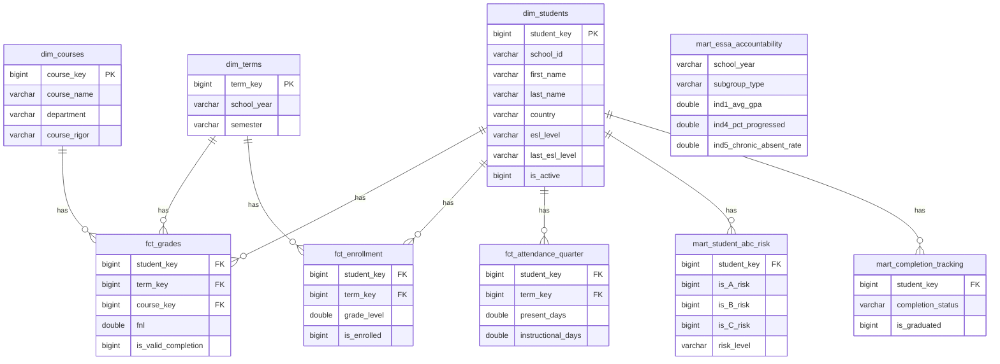

# Test a simpler mermaid first
test_mermaid = '''```mermaid
erDiagram
    dim_students ||--o{ fct_grades : has
    dim_students ||--o{ fct_enrollment : has
    dim_terms ||--o{ fct_grades : has
    dim_courses ||--o{ fct_grades : has
````'''
print(test_mermaid)
````

Let me try a cleaner version that focuses on the core schema:
````python
%%writefile /content/Education-Data/README.md
# Education Data Analytics Portfolio

[](https://education-data-bvqfw2xtdke5dfugzzh3x3.streamlit.app/)

## Overview

Education data warehouse for 636 students across 4 years, demonstrating:
- ESSA 5-indicator accountability framework (including EL Progress tracking)
- FERPA-compliant subgroup reporting (N<10 suppression)
- ABC Early Warning System (Attendance, Behavior, Course performance)
- Cohort-based graduation tracking

*All data anonymized using Marvel character names.*

---

## Tech Stack

| Component | Technology |
|-----------|------------|
| Database | DuckDB (V2.5) |
| Dashboard | Streamlit + Plotly |
| Data Model | Star schema (dimensions + facts + marts) |
| Languages | Python, SQL |

---

## ESSA Indicators

| # | Indicator | Implementation |
|---|-----------|----------------|
| 1 | Academic Achievement | Course pass rate (≥75), Avg GPA |
| 2 | Academic Progress | Year-over-year GPA change |
| 3 | Graduation Rate | Cohort tracking (ACGR-style) |
| 4 | EL Progress | ESL level progression (intake → current) |
| 5 | School Quality | Chronic absenteeism rate (≥10%) |

---

## Database Schema


### Table Summary

| Layer | Tables | Rows |
|-------|--------|------|
| Dimensions | dim_students, dim_terms, dim_courses | 1,942 |
| Reference | ref_countries, ref_attendance_codes | 80 |
| Facts | fct_enrollment, fct_grades, fct_assignments, fct_attendance_* | 314,436 |
| Marts | mart_essa, mart_abc_risk, mart_completion, mart_scorecard | 2,074 |
| **Total** | **17 tables** | **318,532** |

---

## Dashboard Pages

| Page | Description |
|------|-------------|
| **ESSA Scorecard** | All 5 ESSA indicators with 4-year trends and subgroup breakdown |
| **ABC Risk** | Early warning dashboard with risk distribution and student list |
| **Student Lookup** | Individual profiles with GPA trends and risk factors |
| **Completion** | Graduation rates by cohort and program type |
| **Defense Scenarios** | Accountability response templates with trend analysis |
| **Trends** | Historical enrollment, performance, and demographic analysis |
| **Course Analysis** | Department and course-level performance metrics |

---

## Quick Start
```bash
pip install streamlit duckdb plotly pandas
cd streamlit_app
streamlit run app.py
```

---

## Project Structure
````
Education-Data/
├── README.md
├── requirements.txt
├── data/
│   └── school_analytics.duckdb
└── streamlit_app/
    ├── app.py
    └── pages/
        ├── 1_ESSA_Scorecard.py
        ├── 2_ABC_Risk.py
        ├── 3_Student_Lookup.py
        ├── 4_Completion.py
        ├── 5_Defense_Scenarios.py
        ├── 6_Trends.py
        └── 7_Course_Analysis.py
