# Education Data Analytics Portfolio

[](https://education-data-bvqfw2xtdke5dfugzzh3x3.streamlit.app/)

## Overview

Education data warehouse for 636 students across 4 years, demonstrating:
- ESSA 5-indicator accountability framework (including EL Progress tracking)
- FERPA-compliant subgroup reporting (N<10 suppression)
- ABC Early Warning System (Attendance, Behavior, Course performance)
- Cohort-based graduation tracking

*All data anonymized using Marvel character names.*

---

## Tech Stack

| Component | Technology |
|-----------|------------|
| Database | DuckDB (V2.5) |
| Dashboard | Streamlit + Plotly |
| Data Model | Star schema (dimensions + facts + marts) |
| Languages | Python, SQL |

---

## ESSA Indicators

| # | Indicator | Implementation |
|---|-----------|----------------|
| 1 | Academic Achievement | Course pass rate (≥75), Avg GPA |
| 2 | Academic Progress | Year-over-year GPA change |
| 3 | Graduation Rate | Cohort tracking (ACGR-style) |
| 4 | EL Progress | ESL level progression (intake → current) |
| 5 | School Quality | Chronic absenteeism rate (≥10%) |

---

## Database Schema

```mermaid
erDiagram
    dim_students {
        bigint student_key PK
        varchar school_id UK
        varchar first_name
        varchar last_name
        varchar gender
        varchar country FK
        varchar program_type
        varchar esl_level
        varchar last_esl_level
        bigint is_active
        bigint ever_boarding
    }
    dim_terms {
        bigint term_key PK
        varchar term_name
        varchar school_year
        varchar semester
        bigint term_order
    }
    dim_courses {
        bigint course_key PK
        varchar course_code
        varchar course_code_base UK
        varchar course_name
        varchar department
        varchar course_rigor
        bigint is_lab
    }
    ref_countries {
        varchar country PK
        varchar region
    }
    ref_attendance_codes {
        varchar code PK
        varchar description
        varchar category
    }
    fct_enrollment {
        bigint enrollment_key PK
        bigint student_key FK
        bigint term_key FK
        double grade_level
        bigint is_boarding
        bigint is_enrolled
    }
    fct_grades {
        bigint id PK
        bigint student_key FK
        bigint term_key FK
        bigint course_key FK
        varchar teacher
        double q1
        double q2
        double q3
        double q4
        double fnl
        bigint is_valid_completion
    }
    fct_assignments {
        bigint id PK
        bigint student_key FK
        bigint term_key FK
        bigint course_key FK
        varchar teacher
        varchar assignment_name
        double points_earned
        double points_possible
        bigint is_missing
    }
    fct_attendance_quarter {
        bigint id PK
        bigint student_key FK
        bigint term_key FK
        varchar quarter
        double instructional_days
        double present_days
        bigint total_absent
    }
    fct_attendance_daily {
        bigint id PK
        bigint student_key FK
        bigint term_key FK
        varchar date
        varchar period_1
        varchar period_2
        varchar hr
    }
    mart_essa_accountability {
        varchar school_year
        varchar subgroup_type
        varchar subgroup_value
        bigint student_count
        bigint is_suppressed
        double ind1_avg_gpa
        double ind4_pct_progressed
        double ind5_chronic_absent_rate
    }
    mart_student_abc_risk {
        bigint student_key FK
        double absence_rate
        bigint is_A_risk
        bigint is_B_risk
        bigint is_C_risk
        varchar risk_level
    }
    mart_completion_tracking {
        bigint student_key FK
        bigint expected_grad_year
        varchar completion_status
        bigint is_graduated
    }
    mart_student_scorecard {
        bigint student_key FK
        varchar school_year
        double avg_fnl
        double absence_rate
        varchar risk_level
    }

    dim_students ||--o{ fct_enrollment : "student_key"
    dim_students ||--o{ fct_grades : "student_key"
    dim_students ||--o{ fct_assignments : "student_key"
    dim_students ||--o{ fct_attendance_quarter : "student_key"
    dim_students ||--o{ fct_attendance_daily : "student_key"
    dim_students ||--o{ mart_student_abc_risk : "student_key"
    dim_students ||--o{ mart_completion_tracking : "student_key"
    dim_students ||--o{ mart_student_scorecard : "student_key"
    dim_students }o--|| ref_countries : "country"
    dim_terms ||--o{ fct_enrollment : "term_key"
    dim_terms ||--o{ fct_grades : "term_key"
    dim_terms ||--o{ fct_assignments : "term_key"
    dim_terms ||--o{ fct_attendance_quarter : "term_key"
    dim_terms ||--o{ fct_attendance_daily : "term_key"
    dim_courses ||--o{ fct_grades : "course_key"
    dim_courses ||--o{ fct_assignments : "course_key"
```


### Table Summary

| Layer | Tables | Rows |
|-------|--------|------|
| Dimensions | dim_students, dim_terms, dim_courses, dim_quarters, dim_courses_base | 1,942 |
| Reference | ref_countries, ref_attendance_codes | 80 |
| Facts | fct_enrollment, fct_grades, fct_assignments, fct_attendance_* | 314,436 |
| Marts | mart_essa, mart_abc_risk, mart_completion, mart_scorecard | 2,074 |
| **Total** | **17 tables** | **318,532** |

---

## Dashboard Pages

| Page | Description |
|------|-------------|
| **ESSA Scorecard** | All 5 ESSA indicators with 4-year trends and subgroup breakdown |
| **ABC Risk** | Early warning dashboard with risk distribution and student list |
| **Student Lookup** | Individual profiles with GPA trends and risk factors |
| **Completion** | Graduation rates by cohort and program type |
| **Defense Scenarios** | Accountability response templates with trend analysis |
| **Trends** | Historical enrollment, performance, and demographic analysis |
| **Course Analysis** | Department and course-level performance metrics |

---

## Quick Start
```bash
pip install streamlit duckdb plotly pandas
cd streamlit_app
streamlit run app.py
```

---

## Project Structure
```
Education-Data/
├── README.md
├── requirements.txt
├── data/
│   └── school_analytics.duckdb
└── streamlit_app/
    ├── app.py
    └── pages/
        ├── 1_ESSA_Scorecard.py
        ├── 2_ABC_Risk.py
        ├── 3_Student_Lookup.py
        ├── 4_Completion.py
        ├── 5_Defense_Scenarios.py
        ├── 6_Trends.py
        └── 7_Course_Analysis.py
```

---

## Data Anonymization

| Original | Anonymized |
|----------|------------|
| Student names | Marvel characters (636) |
| Teacher names | Fictional TV/movie teachers (178) |
| Countries | Preserved (real country names) |
| School IDs | Sequential format (S000001) |

All analytical relationships and metrics preserved.

---

## Version History

| Version | Date | Changes |
|---------|------|---------|
| V2.5 | Jan 2026 | EL Progress indicator, fixed graduation logic, is_valid_completion filter |
| V2.0 | Jan 2026 | Initial public release with 7 dashboard pages |

---

## Skills Demonstrated

**Technical:** SQL, Python, DuckDB, Streamlit, Star Schema Design, ETL

**Domain:** ESSA Accountability, FERPA Compliance, K-12 Metrics, Early Warning Systems

---

## Author

**SamOryeJack** - Portfolio project for Research and Accountability Data Analyst positions.
