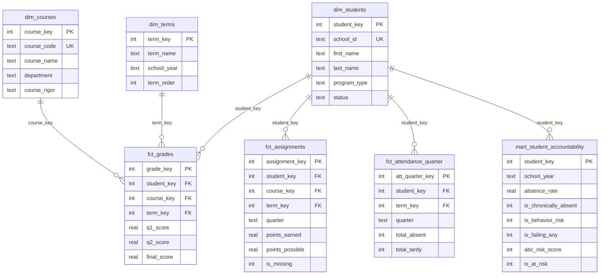

# 🎓 Education Data Warehouse

Student data warehouse tracking **636 international students** across 4 school years. Star schema design with **312K+ records** integrating data from 3 source systems. Built to demonstrate K-12 accountability analytics and at-risk identification using the **ABC Early Warning Framework**.

## 🚀 Live Dashboard

**[View Interactive Dashboard](https://education-data-bvqfw2xtdke5dfugzzh3x3.streamlit.app/)** *(Streamlit Cloud)*

---

## 📊 Key Metrics

| Metric | Value |
|--------|-------|
| Total Records | 312,439 |
| Unique Students | 636 |
| School Years | 4 (2022-2026) |
| Source Systems | 3 (Infinite Campus, Salesforce, Reach) |
| Countries Represented | 23 |
| Average Pass Rate | 94.0% |

---

## 🛠️ Tech Stack

| Layer | Technology | Purpose |
|-------|------------|---------|
| Database | **DuckDB** | Analytical database (columnar, fast) |
| Transformation | **dbt-core** | SQL modeling with tests & docs |
| Dashboard | **Streamlit** | Interactive web application |
| Visualization | **Plotly** | Charts and graphs |
| Cloud | **Streamlit Cloud** | Free hosting |

---

## 📁 Project Structure

```
Education-Data/
├── README.md
├── requirements.txt
├── .gitignore
│
├── data/
│   └── school_analytics.duckdb      # DuckDB database (5.3 MB)
│
├── dbt_project/                      # dbt transformation layer
│   ├── dbt_project.yml
│   ├── profiles.yml
│   └── models/
│       ├── staging/                  # 5 staging models
│       ├── intermediate/             # 4 intermediate models
│       └── marts/                    # 2 mart models
│
├── streamlit_app/                    # Interactive dashboard
│   ├── app.py
│   └── pages/
│       ├── 1_📊_Overview.py
│       ├── 2_👤_Student_Detail.py
│       └── 3_📈_Subgroup_Analysis.py
│
├── images/                           # Visualization assets
│   ├── Analytics_dashboard.png
│   ├── enrollment_trends.png
│   └── retention_analysis_HW.png
│
├── queries/                          # Sample SQL queries
│   └── Queries.sql
│
└── docs/                             # Documentation
    ├── CURRENT_STATE.md
    ├── TARGET_STATE.md
    └── MIGRATION_PLAN.md
```

---

## 🎯 ABC Early Warning Framework

Students are identified as **at-risk** using three indicators aligned with ESSA accountability requirements:

| Factor | Metric | Threshold | Column |
|--------|--------|-----------|--------|
| **A**ttendance | Chronic Absence | ≥10% days missed | `is_chronically_absent` |
| **B**ehavior | Discipline | ISS≥1, OSS≥1, Cuts≥2, or Truancy≥1 | `is_behavior_risk` |
| **C**ourse | Failing Grades | Any final grade <75 | `is_failing_any` |

**At-Risk Definition**: Students with **2+ risk factors** (abc_risk_score ≥ 2)

### Results by Year

| Year | Students | Chronic Absent | Behavior Risk | Failing Any | At-Risk |
|------|----------|----------------|---------------|-------------|---------|
| 2022-23 | 230 | 33.5% | 20.0% | 27.0% | 22.2% |
| 2023-24 | 260 | 46.9% | 8.8% | 30.8% | 23.5% |
| 2024-25 | 253 | 12.3% | 6.3% | 24.1% | 8.3% |
| 2025-26 | 228 | 1.3% | 3.1% | 25.0% | 3.1% |

*Note: 2025-26 is partial year (Fall semester only)*

---

## 📐 Database Schema



*Star schema: 3 dimensions, 6 facts, 2 marts, 1 reference table*

---

## 📊 Database Tables

| Table | Rows | Layer | Description |
|-------|------|-------|-------------|
| dim_students | 636 | Core | Student dimension (anonymized) |
| dim_terms | 8 | Core | Academic terms |
| dim_courses | 1,058 | Core | Course catalog |
| fct_grades | 8,623 | Core | Quarterly grades |
| fct_assignments | 265,571 | Core | Assignment scores |
| fct_attendance_quarter | 3,884 | Core | Quarter attendance |
| fct_attendance_course | 7,792 | Core | Course attendance |
| fct_attendance_daily | 22,884 | Core | Daily attendance |
| fct_student_term_enrollment | 1,942 | Core | Enrollment by term |
| ref_attendance_codes | 42 | Reference | Code definitions |
| **mart_student_accountability** | **971** | **Mart** | **ABC risk profiles** |
| mart_school_year_summary | 32 | Mart | Aggregated metrics |
| **Total** | **~314K** | | |

---

## 📈 Analytics Dashboard


**Top Row:** Population demographics (Countries, Program Types, Course Rigor)  
**Bottom Row:** Year-over-year accountability metrics (Average Grade, Pass Rate, Attendance)

---

## 🔍 Sample Analysis

### 1. Enrollment and Performance Trends


Dual-axis visualization showing enrollment growth alongside academic performance over 4 years.

```sql
SELECT 
    t.school_year,
    COUNT(DISTINCT g.student_key) as total_students,
    ROUND(AVG(g.q1_score), 1) as avg_q1,
    ROUND(AVG(g.q2_score), 1) as avg_q2,
    SUM(CASE WHEN g.q1_score < 75 THEN 1 ELSE 0 END) as failing_grades,
    ROUND(100.0 * SUM(CASE WHEN g.q1_score >= 75 THEN 1 ELSE 0 END) / COUNT(*), 1) as pass_rate
FROM fct_grades g
JOIN dim_terms t ON g.term_key = t.term_key
WHERE g.q1_score IS NOT NULL
GROUP BY t.school_year
ORDER BY t.school_year;
```

---

### 2. Retention Risk Analysis


**Finding:** Students who stay longer miss less homework — 3x difference between short-term (1.8%) and long-term (0.6%) students. This pattern suggests missing homework rate could serve as an early warning indicator for retention risk.

```sql
SELECT 
    terms_enrolled,
    ROUND(AVG(missing_pct), 1) as avg_missing_pct,
    COUNT(*) as num_students
FROM (
    SELECT 
        s.student_key,
        COUNT(DISTINCT e.term_key) as terms_enrolled,
        COUNT(a.assignment_key) as total_assignments,
        SUM(a.is_missing) as missing_assignments,
        ROUND(100.0 * SUM(a.is_missing) / COUNT(a.assignment_key), 1) as missing_pct
    FROM dim_students s
    JOIN fct_student_term_enrollment e ON s.student_key = e.student_key
    JOIN fct_assignments a ON s.student_key = a.student_key
    GROUP BY s.student_key
    HAVING total_assignments >= 20
) student_metrics
GROUP BY terms_enrolled
ORDER BY terms_enrolled;
```

---

## 🚀 Quick Start

### Prerequisites
- Python 3.9+
- pip

### Installation

```bash
# Clone repository
git clone https://github.com/SamOryeJack/Education-Data.git
cd Education-Data

# Install dependencies
pip install -r requirements.txt

# Run dbt models (optional - already materialized)
cd dbt_project
dbt run --profiles-dir .
dbt test --profiles-dir .

# Launch dashboard locally
cd ../streamlit_app
streamlit run app.py
```

---

## 🔧 dbt Models

### Model Lineage

```
Source Tables (10)
    │
    ▼
Staging Layer (5 views)
    ├── stg_students
    ├── stg_grades
    ├── stg_attendance_quarter
    ├── stg_attendance_daily
    └── stg_assignments
    │
    ▼
Intermediate Layer (4 tables)
    ├── int_student_attendance      → is_chronically_absent
    ├── int_student_behavior        → is_behavior_risk
    ├── int_student_course_performance → is_failing_any
    └── int_student_assignments     → is_high_missing
    │
    ▼
Marts Layer (2 tables)
    ├── mart_student_accountability → Complete ABC profile
    └── mart_school_year_summary    → Aggregated metrics
```

### Running dbt

```bash
cd dbt_project
dbt debug --profiles-dir .   # Verify connection
dbt run --profiles-dir .     # Build all models
dbt test --profiles-dir .    # Run 23 tests
dbt docs generate            # Generate documentation
```

---

## 🔒 Data Privacy

All student data has been **anonymized**:
- Student names → Marvel character names (636 characters)
- Teacher names → Fictional TV/movie teachers (178 teachers)
- All real identifiers removed

Mapping files available in `data/` for reference.

---

## 📚 Additional Resources

- [`queries/Queries.sql`](queries/Queries.sql) - Additional SQL examples
- [`docs/CURRENT_STATE.md`](docs/CURRENT_STATE.md) - Current project state
- [`docs/data_dictionary.md`](docs/data_dictionary.md) - Column definitions

---

## 💼 Skills Demonstrated

| Category | Skills |
|----------|--------|
| **Data Modeling** | Star schema, Kimball methodology, fact/dimension design |
| **SQL** | CTEs, window functions, aggregations, complex joins |
| **dbt** | Models, tests, documentation, staging/marts pattern |
| **Python** | Streamlit, Plotly, pandas, data pipelines |
| **Analytics** | ESSA accountability, ABC framework, cohort analysis |
| **Data Integration** | Identity resolution across 3 source systems |

---

## 👤 Author

**Sam Oryejack**  
Campus Coordinator | Data Analytics  
[LinkedIn][(https://linkedin.com/in/yourprofile) ](https://www.linkedin.com/in/paul-desmond-155495219/)
---

*Built as a portfolio project demonstrating K-12 accountability analytics skills for Research and Accountability Data Analyst roles.*
